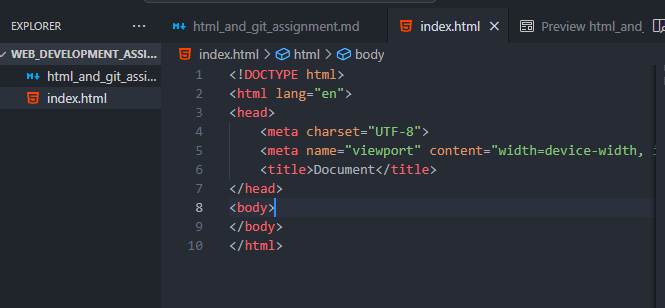
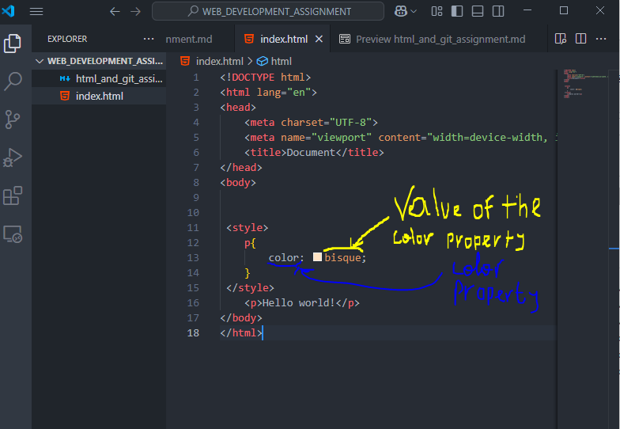
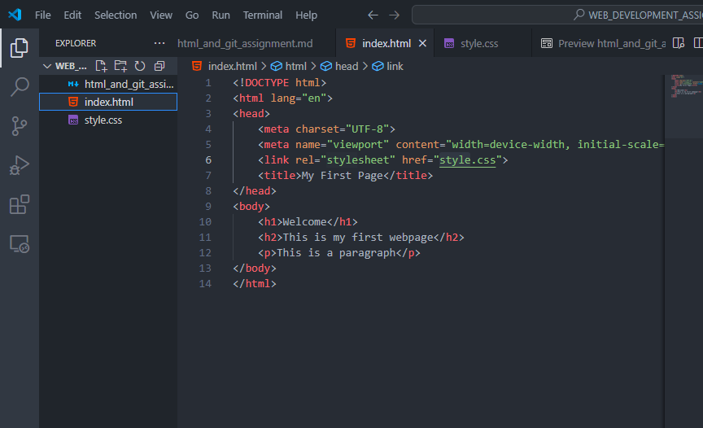
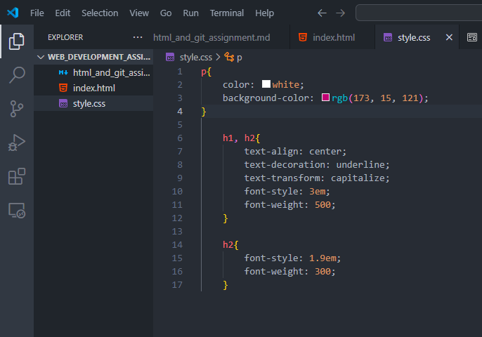

**BASIC HTML & GIT ASSIGNMENT**

*Part A: Multiple Choice Questions*

- a)
- b)
- a)
- a)

*Part B: STRUCTURAL QUESTIONS*

- Basic structure of an HTML page

 

- Difference between a HTML tag and element

  - _HTML tag_ is located between angles brackets and marks the begining and the end of an element wheareas an _HTML element_ is composed of tags, content beetween tags and attributes (if additional informations are needed) inside the begining tag, after the element's name. 
- Three basic selectors
  - Type selectors
  - Class selectors
  - ID selectors

- Purpose of git add command

  _git add_ command add change(s) to the git stage, allowing it (them) to be tracked by git in order to be ready for the next commit

- CSS property and value explanation

  _CSS property_ is a common CSS term which determines the styles that will be apply to an element whereas a _value_ is used to determines the behavior of a property. In the screeshot below, _color_ is the property and  _bisique_ the value of the color property apply the p element located in the body of the HTML page. The image below shows the use of each term in practice :

  

*PART C: PRACTICAL*

  - Git Tasks

  - HTML Requirements

     

  - CSS Requirements

    